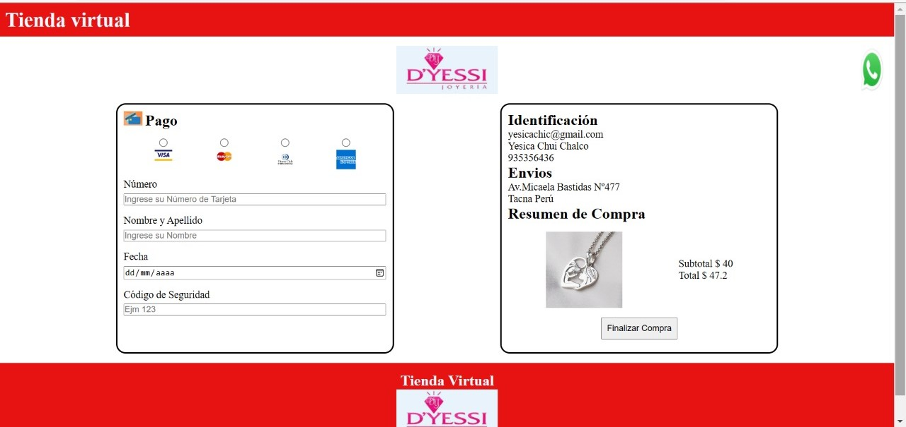

# Tarjeta de crédito válida

## Índice

* [1. Introducción](#1-introducción)
* [2. Definición del Producto](#2-definición-del-producto)
* [3. Diseño Visual](#3-diseño-visual)
* [4. Consideraciones técnicas](#4-consideraciones-técnicas)
* [5. Detalles](#5-detalles)


***

## 1. Introducción

Este proyecto va dirigido a una tienda virtual de Joyas aunque puede usar usado para cualquier e-commerce, se indica identificacion del cliente,  el lugar de envio, el producto seleccionado a comprar, junto con los datos de su tarjeta.
Nos indica si la tarjeta es valida o invalida visualizando en pantalla con diferentes colores segùn la situación.

Cuando es valida muestra solo los 4 digitos finales de la tarjeta y el resto con #.


## 2. Definición del Producto

Revisando diferentes e-commerce note un patron usual de datos y que sería idoneo tener toda la información junta, es bueno tener un resumen en una sola pantalla de lo que se va a comprar.

- ¿Quienes son los principales usuarios del producto?

  Personas que tienen cierta estabilidad financiera y tienen un estilo de vida definido que se concentra en el deseo de verse bien, modernas y originales, que quieren darse gusto estando dispuestas a pagar por tener productos de calidad y exclusivos. 

- ¿Cuáles son los objetivos de estos usuarios en relación con tu producto?

  Lograr adquirir sus joyas rapidamente, para ello seleccionan y realizan la compra desea que al ingresar sus datos desea que el sistema le indique que no se equivoco al ingresar su tarjeta para realizar su compra

- ¿Cómo crees que el producto que estas creando está resolviendo sus problemas?

  Para poder realizar sus compras rapido sin errores y ocultando los datos de su tarjeta al realizar la compra


## 3. Diseño Visual
* Se realizo un dibujo a mano del proyecto web.


* Resultado final



## 4. Consideraciones técnicas

La estructura de archivos del proyecto es la siguiente

```text
./
├── .babelrc
├── .editorconfig
├── .eslintrc
├── .gitignore
├── README.md
├── package.json
├── src
│   ├── validator.js
│   ├── index.html
│   ├── index.js
│   └── style.css
└── test
    ├── .eslintrc
    └── validator.spec.js
```

## 5. Detalles


* [ x ] Tiene una interfaz que permite a la usuaria saber si la tarjeta es valida.
* [ x  ] Se oculta el número de tarjeta excepto los 4 últimos digitos.
* [ x ] En el proyecto se realizaron pruebas unitarias de los métodos de
  `validator` (`isValid` y `maskify`).
* [ x ] El proyecto esta libre de _errores_ de `eslint` (_warnings_ son ok).
* [ x ] El código del proyecto está en GitHub.
* [ x ] La interfaz esta "desplegada" usando GitHub Pages.
* [ x ] El README contiene una definición del producto.


